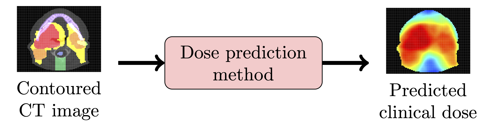

# OpenKBP Grand Challenge - best model of PTV group

  
This is the network implementation of the Prediction Team Vienna for the _open-kbp_ grand challenge. The repository can be used only a local machine for now. 

 

## What this code does
  
  - _our_code/3D_loss.py_: includes a pretrained 3D model trained on kinetics video data used as for the feature loss.
  - _our_code/model_pix2pix.py_: Includes the basic U-Net model of pix2pix. Further options are available such as different 
   activation functions, normalisations, and ResNet blocks.
  - _train.py_: Is the main file from which the training takes place. You can directly alter the code from a editior e.g. PyCharm or
   you use the parser arguments over the command prompt.

## Requirements
Pytorch >=1.4

Pytorch Lightning >= 0.7.6 and <= 0.8.5

numpy >= 1.18.2

wandb >= 0.8.36
